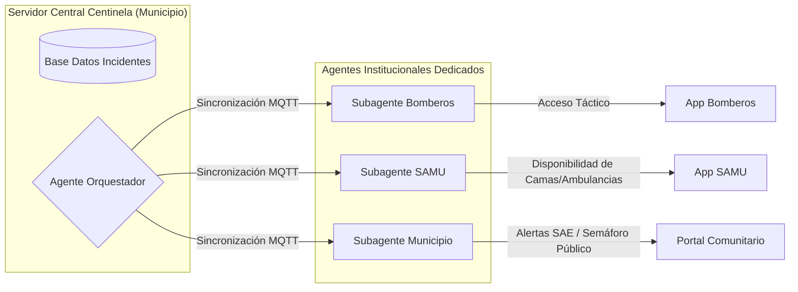

# 🔬 Análisis de Viabilidad, Predicción de IA y Estructura de Costos: Proyecto Centinela

Este documento compila un estudio de viabilidad técnica y análisis de impacto sistémico para el **Proyecto Centinela**, utilizando los datos empíricos de la catástrofe hidrometeorológica de **La Serena (Julio 2026)** para modelar la capacidad predictiva de la IA, el escalamiento multiorganismo y los costos de implementación real.

---

## 📈 1. Capacidad Predictiva de la IA/ML frente a Crisis Extremas

¿Es capaz el modelo de predecir eventos catastróficos como el desborde del río Elqui y la activación de quebradas en Lambert/Pueblo Islón? **Sí, mediante un enfoque de física acoplada a Machine Learning (Sim2Real)**. No dependemos de una "caja negra" de IA, sino de relaciones causales claras:

### A. Predicción de Caudales y Desbordes Fluviales
* **El Método:** Redes Neuronales Recurrentes (LSTM) o modelos de regresión secuencial locales.
* **Entradas (Inputs):**
  1. *Datos Meteorológicos:* Pronósticos cuantitativos de lluvia (mm/h) y viento de APIs satelitales.
  2. *Isoterma Cero:* Nivel de altitud térmica de la DMC (Dirección Meteorológica de Chile).
  3. *Sensores Hidrométricos:* Nivel y caudal en tiempo real de la cuenca alta (Río Claro, Río Turbio).
* **Lógica del Modelo:** Si la isoterma cero se ubica por encima del umbral de acumulación nival normal (ej. 3.000m en La Serena) y se proyectan precipitaciones líquidas masivas, el modelo calcula de inmediato el **coeficiente de escorrentía superficial extrema** en alta cordillera. Esto permite estimar el caudal pico ($m^3/s$) y la inundación en la cuenca baja con una ventana de **6 a 12 horas de anticipación** al desborde físico.

### B. Predicción de Activación Súbita de Quebradas
* **El Método:** Modelos de clasificación binaria (Random Forest / SVM) basados en umbrales de saturación de suelo.
* **Entradas (Inputs):** Índice de Precipitación Antecedente (API) calculado a partir de la humedad histórica del suelo y la intensidad de lluvia en curso.
* **Lógica del Modelo:** El modelo evalúa si la tasa de precipitación supera la capacidad de infiltración de suelos compactados (Megasequía). Al cruzar el umbral de lodosidad crítica, emite una alerta temprana de aluvión para quebradas inactivas (Lambert, Santa Gracia) antes del descenso físico del barro.

---

## 👥 2. Público Objetivo e Integración de Organismos a Gran Escala

### A. Los Early Adopters (Usuarios Piloto)
El primer público objetivo no debe ser la comunidad en general, sino los **organismos técnicos de respuesta local**:
1. **Oficinas Municipales de Gestión del Riesgo de Desastres (GRD):** Para planificar evacuaciones preventivas y mitigación física.
2. **Cuerpos de Bomberos Locales (Cuarteles de Compañías):** Para validar alertas en terreno y pre-posicionar personal y material menor (carro bombas, motobombas).

### B. Coordinación Multiorganismo a Gran Escala (Escalabilidad)
Para evitar silos de comunicación y duplicación de esfuerzos entre Bomberos, SAMU, Carabineros y Defensa Civil, el sistema operará bajo una **Arquitectura de Estado Compartido Federado**:

---

## 🛠️ 3. Puntos de Mejora Críticos (Higiene del Grafo e Infraestructura)

Tras analizar los fallos del sistema en La Serena (blackouts de energía y caída de antenas celulares en Andacollo), corregimos el diseño original del Proyecto Centinela:

* **Independencia Energética Obligatoria:** Los Gateways centrales y repetidores de radio LoRa mesh del proyecto no pueden depender de la red eléctrica comercial. Se diseñarán como sistemas autónomos de ultra-bajo consumo con baterías de litio (LiFePO4) alimentadas por pequeños paneles solares de 5W.
* **Compresión Extrema en Radio Mesh:** LoRa tiene un ancho de banda reducido. El bot de WhatsApp local no enviará texto libre a través de la red mesh de radio. En su lugar, el mensaje del usuario se codifica en el nodo de origen en una **trama binaria de 4 bytes** (tipo, coordenadas, urgencia) y el Gateway central (que sí posee conexión satelital o LLM local) reconstruye la información semántica en Markdown.

---

## 💸 4. Análisis de Complejidad, Tiempos y Costos Reales

Prototipo inicial diseñado para monitorear **1 cuenca de río y dotar de red mesh a 5 localidades rurales aisladas**:

### A. Estructura de Costos del Hardware (Open Source)
| Componente | Cantidad | Descripción | Costo Unitario (USD) | Costo Total (USD) |
| :--- | :---: | :--- | :---: | :---: |
| **Gateway Central** | 1 | Raspberry Pi 4 (o PC reacondicionado) + Módulo Receptor LoRa USB. | $120.00 | $120.00 |
| **Nodos Repetidores Mesh** | 5 | Placa ESP32 + Transceptor LoRa SX1276 + Panel Solar 5W + Batería LiFePO4 + Caja estanca IP67. | $30.00 | $150.00 |
| **Estación Hidrométrica de Río** | 1 | Sensor ultrasónico impermeable (JSN-SR04T) + ESP32 + Sistema Solar. | $35.00 | $35.00 |
| **Costo Total Hardware** | - | *Inversión en componentes electrónicos básicos de código abierto.* | - | **$305.00 USD** |

*Nota: Esto equivale aproximadamente a $280.000 CLP, una fracción minúscula de los costes de licencias de sistemas comerciales como Viper.*

### B. Complejidad del Software e Hitos Temporales
1. **Fase 1: Simulación Física y Algoritmos (Semanas 1-4):**
   - Desarrollo del entorno de simulación del río, escorrentía e isoterma en Python.
   - Creación del clasificador de texto local y regresor para estimar desbordes.
2. **Fase 2: Pruebas de Campo de Radio LoRa en Fresia (Semanas 5-8):**
   - Construcción del prototipo físico del nodo por parte de Moisés en terreno para validar alcance de señal en bosques y geografía del sur.
3. **Fase 3: Agentes de Triage y Bot de WhatsApp Local (Semanas 9-11):**
   - Programación con `strands-agents` y visualización de mapas offline con `Folium`/OpenStreetMap.
4. **Fase 4: Validación y Feedback con Bomberos (Semana 12):**
   - Demostración del prototipo a la 6ª Compañía de Bomberos de La Serena para afinar métricas operativas de campo.

---

## ⚙️ 5. Requerimientos de Hardware para Modelos AI/ML e Infraestructura

Para mantener el principio de **bajo costo** y **resiliencia offline**, la arquitectura de hardware está calculada para ejecutarse localmente sin requerir servidores en la nube ni tarjetas gráficas (GPUs) de alto valor:

### A. Requerimientos para Modelos de IA (Servidor Local/Gateway)
En el Cuartel General de Bomberos o Municipio, los modelos de IA se ejecutarán localmente bajo las siguientes especificaciones:

| Modelo / Tarea | Mapeo Técnico | RAM Necesaria | CPU Recomendada | Disco (Almacenamiento) |
| :--- | :--- | :---: | :--- | :--- |
| **Predicción de Riesgo (ML)** | Regresores e Histogramas de Scikit-learn (desbordes/cortes). | < 50 MB | 1 Núcleo ARM/x86 (Raspberry Pi 4). | < 10 MB |
| **Clasificación de Fotos (Visión)** | MobileNetV3 / ONNX Runtime (detección de escombros/daños). | ~100 MB | 1 Núcleo (Inferencia < 1 seg por foto). | ~30 MB |
| **Razonamiento Agentes (NLP)** | Llama 3.2 1B Instruct (Cuantizado Q4_K_M via llama.cpp/Ollama). | **~2 GB** | CPU Multi-núcleo ligera (Raspberry Pi 5 o i5 antiguo). | ~1.1 GB |
| **Razonamiento Agentes (Avanzado)** | Llama 3.2 3B Instruct (Cuantizado Q4_K_M para tareas complejas). | **~4 GB** | CPU Multi-núcleo moderna (Mini-PC i5/i7 reacondicionada). | ~2.2 GB |

* **Hardware de Servidor Recomendado:** Una **Mini-PC usada/reacondicionada** (Intel Core i5, 8GB/16GB RAM, SSD 120GB) con un costo de **~$80-$120 USD**, o una **Raspberry Pi 5 de 8GB RAM (~$80 USD)**. Ambas pueden procesar el bucle de agentes y el triage de forma 100% offline y asíncrona mediante CPU.

### B. Hardware de Campo (IoT y Red Mesh)
La capa física de recolección de datos en el terreno rural de Fresia usará componentes asequibles:
1. **Nodos Mesh Repetidores:**
   - *Microcontrolador:* **ESP32-WROOM-32E** (Dual-core 240MHz, 520KB SRAM). Costo: ~$3 USD.
   - *Radio:* Transceptor **LoRa SX1276 o SX1278** (915 MHz para Chile). Costo: ~$4 USD.
   - *Alimentación:* 1 Batería 18650 LiFePO4 de 3.2V (alta durabilidad térmica) alimentada por un panel solar miniatura de 5V/5W con regulador de carga.
2. **Sensor Ultrasónico de Río:**
   - *Dispositivo:* Sensor impermeable **JSN-SR04T** (rango 20cm a 450cm). Transmite por puerto serie al ESP32. Resistente a inundaciones breves e intemperie. Costo: ~$10 USD.
3. **Gateway de Recepción de Radio:**
   - *Dispositivo:* Una placa ESP32 conectada por cable USB (puerto serie virtual) a la Raspberry Pi o Mini-PC en el cuartel. Su única función es recibir los paquetes de radio binarios y entregárselos al script Python.

---
🔗 [[Home|Panel de Control Unificado]] | 🔗 [[10_Projects/Proyecto_Aurora/Proyecto_Aurora_Dashboard|Dashboard Proyecto Aurora]] | 🔗 [[10_Projects/Proyecto_Centinela/Docs/Proyecto_Centinela_OnePager|One-Pager Proyecto Centinela]] | 🔗 [[10_Projects/Proyecto_Centinela/Docs/Presentacion_Proyecto_Centinela|Presentación de Proyecto Centinela]]

---
## 🔗 Conexiones
* [[10_Projects/Proyecto_Centinela/Knowledge/proyecto_centinela|Dashboard Proyecto Centinela]]
* [[Home|Panel de Control Unificado]]
