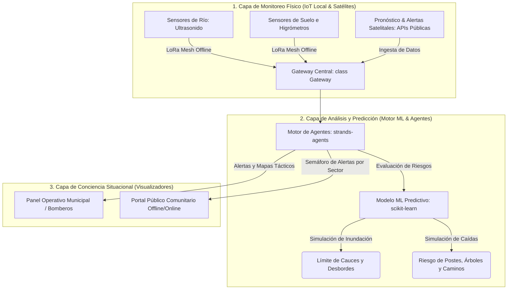

# 📡 Proyecto Centinela: Monitoreo, Alerta Temprana y Prevención Rural

Este documento define el enfoque estratégico, arquitectura y stack del **Proyecto Centinela**, un ecosistema de bajo costo diseñado para la prevención, monitoreo de riesgos climáticos en tiempo real y la toma de decisiones anticipadas en comunidades rurales y de difícil conectividad.

---

## 🎯 1. Declaración del Problema (HMW)
> ¿Cómo podríamos diseñar un conjunto de herramientas de bajo costo que unifique sensores físicos locales (IoT), datos de teledetección (satélites) y modelos predictivos de Machine Learning, para monitorear amenazas climáticas (inundaciones, cortes de servicios) y permitir a bomberos, municipios y vecinos tomar decisiones preventivas coordinadas?

---

## 🛠️ 2. Arquitectura de Tres Capas (Sim2Real)

El sistema se enfoca en la **proactividad** (actuar antes de que ocurra la emergencia) y se compone de tres módulos interactivos:

---

## 💻 3. Módulos y Enfoque de Prevención Científica

### A. Monitoreo Físico IoT (Bajo Costo)
* **Monitoreo de Ríos:** Nodos ultrasónicos instalados en puentes y riberas críticas para medir el nivel y velocidad del agua.
* **Humedad del Terreno:** Sensores de humedad de suelo que estiman la saturación de la tierra frente a lluvias intensas.
* **Red de Datos:** Transmisión local mediante LoRaWAN o redes mesh ESP-NOW de bajo costo, asegurando el flujo de datos aun si cae la red celular móvil.

### B. Motor Predictivo de Inteligencia Artificial (ML & Agentes)
* **Predicción de Inundaciones:** Un modelo de Machine Learning que combina el nivel del río medido por los sensores con el pronóstico de precipitaciones de las próximas 48 horas (APIs meteorológicas) y calcula el tiempo estimado de desborde y áreas afectadas.
* **Modelado de Caídas y Aislamiento:** Estimación del riesgo de caída de árboles o postes de energía basado en la velocidad del viento prevista y la saturación del suelo (tierra lodosa aumenta la probabilidad de desraizamiento).
* **Agentes de Gestión de Recursos (strands-agents):**
  * `AlertAgent`: Emite alertas diferenciadas y geolocalizadas según el nivel de riesgo por sector.
  * `PreventionAgent`: Recomienda el posicionamiento táctico preventivo de recursos (ej: ubicar motobombas de desagüe o despejar caminos críticos *antes* de que empiece la tormenta).

### C. Difusión y Conciencia Pública
* **Portal de Emergencia para Bomberos/Municipios:** Visualización en tiempo real de gráficos de nivel de ríos, mapas térmicos de saturación de suelo e índice de riesgo por zonas.
* **Portal Comunitario Público:** Sitio web extremadamente ligero y optimizado (portabilidad offline por Wi-Fi de emergencia) que muestra a los vecinos el "Semáforo de Alerta" por sector (Verde: Estable; Amarillo: Preparación; Rojo: Evacuación/Acción).

---

## 🚫 4. Lo que NO Haremos en el MVP (Not Doing)

* **No despacho reactivo de carros:** No competiremos con plataformas de despacho de llamadas. El sistema no gestiona alarmas ni llamadas de emergencia, sino la **infraestructura preventiva y de alerta temprana**.
* **No sensores costosos comerciales:** Se descarta el uso de estaciones hidrométricas comerciales de alto costo. Todos los diseños de hardware se basarán en hardware abierto (Open Hardware) de bajo presupuesto.
* **No APIs con costes recurrentes:** Evitaremos integraciones propietarias que requieran suscripciones mensuales. Usaremos APIs públicas (ej: Open-Meteo, Google Flood Hub, Copernicus).

---

## 🗓️ 5. Fases del Proyecto

* **Fase 1 (Simulación Física en Python):** Programación del simulador de sensores y el cauce virtual del río.
* **Fase 2 (Entrenamiento del Modelo ML):** Diseñar y entrenar un predictor lineal/clasificador que determine el riesgo de desborde a partir de variables simuladas.
* **Fase 3 (Agentes Preventivos):** Implementación del flujo de alertas con `strands-agents` y bucles POO de decisión.
* **Fase 4 (Interfaces Visuales):** Creación del portal público y el panel municipal en HTML/Matplotlib.

---
🔗 [[Home|Panel de Control Unificado]] | 🔗 [[10_Projects/Proyecto_Aurora/Proyecto_Aurora_Dashboard|Dashboard Proyecto Aurora]] | 🔗 [[10_Projects/Proyecto_Centinela/Docs/Presentacion_Proyecto_Centinela|Presentación de Proyecto Centinela]]

---
## 🔗 Conexiones
* [[10_Projects/Proyecto_Centinela/Knowledge/proyecto_centinela|Dashboard Proyecto Centinela]]
* [[Home|Panel de Control Unificado]]
