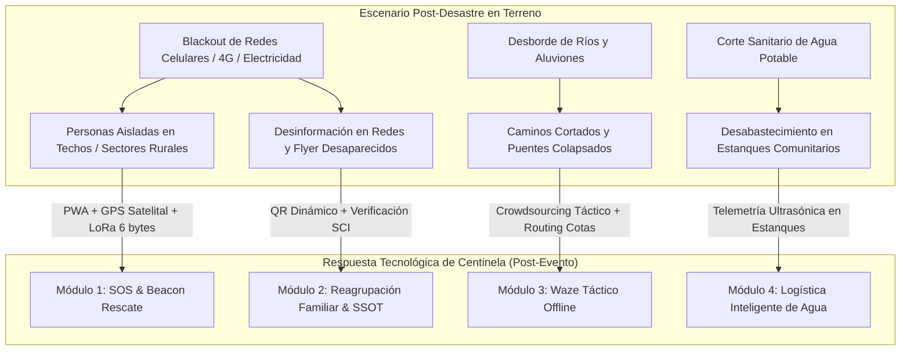

# 🚨 Módulos de Innovación Tecnológica Post-Desastre: Proyecto Centinela

Este documento define la arquitectura funcional y los módulos de tecnología del **Proyecto Centinela** orientados a la **fase post-desastre** (después de ocurridas las lluvias, desbordes, cortes de caminos e incomunicación), centrándose exclusivamente en innovación de software, ciencia de datos y redes resilientes, sin abarcar ingeniería civil o de infraestructura física.

---

## 🧭 1. El Desafío Operativo del "Día Después" (Escenario Post-Evento)

Tras un evento hidrometeorológico extremo (como el de La Serena de julio de 2026), la emergencia muta de un problema de alertamiento a uno de **logística de rescate, gestión del caos e incomunicación territorial**:

---

## 🛠️ 2. Módulos Tecnológicos Post-Desastre de Centinela

### Módulo 1: SOS & Beacon de Rescate (Triage de Víctimas Aisladas)
* **El Problema:** Víctimas atrapadas en techos o aisladas en quebradas (ej: El Islón o Chacay) no pueden llamar al 133 ni al 132. Rescatistas buscan a ciegas sin saber dónde hay emergencias médicas reales.
* **Innovación Tecnológica:**
  - **Portal Mesh PWA Cautivo:** Servido localmente por las antenas repetidoras de Centinela en la zona aislada. El celular del vecino se conecta a la red Wi-Fi de emergencia y abre una página ligera (<50 KB).
  - **GPS Satelital Offline (HTML5):** Utiliza `navigator.geolocation` para capturar latitud y longitud puras desde los satélites GPS del teléfono, **sin requerir internet ni plan de datos**.
  - **Formulario Táctico SCI-201 (3 Clics):** El usuario selecciona su nivel de urgencia:
    - 🔴 **Riesgo Vital / Atrapado / Emergencia Médica** (ej: diálisis, lactante, herido).
    - 🟡 **Aislado Incomunicado** (estable, pero sin agua/alimentos).
    - 🟢 **Aislado Seguro**.
  - **Trama SOS Ultra-Comprimida (6 Bytes):**
    $$\text{Trama SOS} = [\text{Severidad (1 byte)} \,\|\, \text{Latitud (2.5 bytes)} \,\|\, \text{Longitud (2.5 bytes)}]$$
    Transmitida mediante saltos de radio LoRa/ESP-NOW al Puesto de Mando del SCI.
  - **Impacto:** Genera un **Mapa de Calor de Prioridad de Rescate** en tiempo real para Bomberos y Helicópteros, dirigiendo las lanchas o aeronaves a las coordenadas exactas de mayor riesgo vital.

---

### Módulo 2: Reagrupación Familiar y Registro Unificado de Desaparecidos (SSOT)
* **El Problema:** Familiares desesperados inundan redes sociales con fotos de personas búsquedas. Cuando la persona aparece en un albergue o centro de salud, los afiches siguen circulando, generando desinformación.
* **Innovación Tecnológica:**
  - **Código QR Dinámico de Búsqueda:** La solicitud de búsqueda genera una ficha con un ID único y un código QR.
  - **Triage en Albergues y Centros de Salud:** Al ingresar un evacuado a un albergue o recinto de salud, el personal escanea su carnet de identidad o lo ingresa en la app local offline de Centinela.
  - **Actualización Remota de Estado (SSOT):** El estado cambia automáticamente a `LOCALIZADO EN ALBERGUE X (ESTABLE)`. Cualquier persona que escanee el QR original (en un flyer o red social) ve el estado actualizado en tiempo real, invalidando la búsqueda y liberando recursos del COGRID.

---

### Módulo 3: "Waze Táctico Offline" y Enrutamiento por Cotas Seguras
* **El Problema:** Waze y Google Maps no funcionan sin internet y no registran aluviones o puentes destruidos en tiempo real en zonas rurales.
* **Innovación Tecnológica:**
  - **Crowdsourcing Táctico Interinstitucional:** Los vehículos de Bomberos, Carabineros y Municipio reportan en 1 clic desde la app de su carro: `[ CAMINO BLOQUEADO ]`, `[ SOCAVÓN ]` o `[ RUTA HABILITADA SOLO 4X4 ]`.
  - **Sincronización Mesh entre Carros:** Las novedades de rutas se sincronizan entre vehículos mediante la red de radio local.
  - **Enrutamiento Algorítmico por Cotas:** Para llevar camiones aljibe o motobombas a zonas aisladas, el mapa vectorial calcula la trayectoria óptima **evitando zonas con cota de altura inundable**, garantizando que los vehículos de socorro no queden atrapados en el camino.

---

### Módulo 4: Telemetría de Estanques de Agua y Logística de Recursos
* **El Problema:** Tras el corte sanitario de agua potable (como el de Aguas del Valle), se instalan 100+ estanques estacionarios en las comunas. La municipalidad no sabe cuáles están vacíos y la gente hace filas inútiles.
* **Innovación Tecnológica:**
  - **Sensor Ultrasónico de Nivel en Estanque ($10 USD):** Instalado en la tapa superior de los tanques plásticos comunitarios de acopio.
  - **Alertas de Despacho Automático:** Cuando el nivel de agua baja del 20%, el nodo emite una señal LoRa automática a la Central de Camiones Aljibe: *"Estanque N° 42 (Sector El Milagro) requiere recarga inmediata"*.
  - **Portal Comunitario de Estado de Agua:** Vecinos pueden revisar en el semáforo local qué estanque cercano tiene agua disponible antes de salir de sus casas.

---

### Módulo 5: Ficha EDAN Digital (Evaluación de Daños y Necesidades Offline)
* **El Problema:** El catastro de viviendas destruidas o con daño estructural se realiza en papel y tarda días en consolidarse.
* **Innovación Tecnológica:**
  - **Formulario EDAN Digital Móvil:** Los evaluadores municipales registran daños en viviendas desde una app offline.
  - **Compresión de Imágenes:** Las fotos de daños estructurales se comprimen automáticamente a <30 KB y se geolocalizan.
  - **Dashboard Comunal Instantáneo:** Al volver a cobertura o conectarse a un nodo Centinela, se consolida la matriz de daños comunal para la asignación prioritaria de subsidios de emergencia y materiales de reconstrucción.

---

## 📊 3. Matriz Resumen de Valor Tecnológico Post-Desastre

| Módulo Tecnológico | Entrada de Datos | Procesamiento / Algoritmo | Salida Táctica (Beneficio) |
| :--- | :--- | :--- | :--- |
| **SOS Rescate** | GPS Satelital nativo + Formulario PWA. | Trama binaria 6 bytes + LoRa Mesh. | Mapa de Calor de Prioridad de Rescate para Bomberos. |
| **Reagrupación Familiar** | Registro en Albergues / Centros de Salud. | Base de datos sincronizada + QR dinámico. | Fin de la desinformación en redes; confirmación de paradero. |
| **Waze Táctico Offline** | Reportes de carros de bomberos y rescatistas. | Dijkstra/A* con restricción de cotas topográficas. | Rutas seguras para camiones de ayuda y motobombas. |
| **Telemetría de Agua** | Sensor ultrasónico JSN-SR04T en estanque. | Umbrales de volumen estático en tiempo real. | Despacho eficiente de camiones aljibe a tanques vacíos. |
| **EDAN Digital** | Formulario móvil + Fotos comprimidas. | Agregación de datos por sectores de riesgo. | Catastro inmediato de daños habitacionales para el COGRID. |

---

## 🔗 Enlaces y Contexto
🔗 [[10_Projects/Proyecto_Centinela/Docs/Proyecto_Centinela_OnePager|One-Pager Proyecto Centinela]] | 🔗 [[10_Projects/Proyecto_Centinela/Docs/analisis_sistemas_emergencia|Análisis de Sistemas de Emergencia]] | 🔗 [[90_System/Agent_Sync/Active_Context|Contexto Activo]]

---
## 🔗 Conexiones
* [[10_Projects/Proyecto_Centinela/Knowledge/proyecto_centinela|Dashboard Proyecto Centinela]]
* [[Home|Panel de Control Unificado]]
