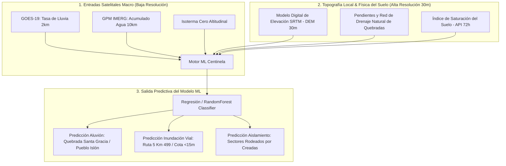

# 🛰️ Precisión Satelital, Latencias NRT y Funcionamiento del Modelo de ML

Este documento responde de forma rigurosa y empírica a las preguntas clave sobre la **precisión física de los datos satelitales**, sus **frecuencias de actualización** y el **mecanismo mediante el cual el modelo de Machine Learning transforma estas señales satelitales en predicciones espaciales de inundación, aluviones y aislamiento** para la comuna de La Serena.

---

## 🎯 1. Matriz de Precisión y Frecuencia de Datos Satelitales

No todos los satélites miden lo mismo ni con la misma frecuencia. El Proyecto Centinela utiliza un **enfoque multi-constelación** para equilibrar alta frecuencia temporal y alta resolución espacial:

| Fuente Satelital | Tipo de Sensor | Resolución Espacial | Frecuencia de Captura | Latencia NRT (Disponibilidad) | Nivel de Precisión Física |
| :--- | :--- | :---: | :---: | :---: | :--- |
| **GOES-19** (NOAA) | ABI (Infrarrojo Térmico) | $\sim 2 \text{ km}$ | **Cada 10 minutos** | **$< 15 \text{ minutos}$** | **Alta en Tiempo Real:** Mide la temperatura de la cima de las nubes para estimar la tasa instantánea de lluvia ($mm/h$) y severidad convectiva. |
| **GPM IMERG Early Run** (NASA/JAXA) | Radiómetros de Microondas Pasivas (PMW) | $0.1^\circ \approx 10 \text{ km}$ | **Cada 30 minutos** | **$\sim 4 \text{ horas}$** | **Muy Alta en Volumen:** Las microondas atraviesan la nube y miden la masa real de agua líquida/hielo en la columna atmosférica. |
| **Sentinel-1C** (ESA) | Radar SAR Banda C (Activo) | **$10 \text{ metros}$** | Cada 6 días | **$< 3 \text{ horas}$** | **Precisión Milimétrica de Inundación:** Atraviesa el 100% de las nubes y mide espejos de agua reales en tierra. |
| **NASA LANCE** (VIIRS/MODIS) | Óptico Multiespectral | $250 \text{ metros}$ | Horario / Diario | **$< 3 \text{ horas}$** | **Alta en Extensión Superficial:** Mapea el avance del agua desbordada en valles y pasos de carretera. |
| **Open-Meteo NRT API** | Reanálisis Numérico & Feeds Satelitales | $\sim 1 \text{ km}$ (grilla interpolada) | **Horaria** | **$< 1 \text{ hora}$** | **Alta Integración:** Consolida precipitación, temperatura, humedad de suelo y viento. |

---

## ⏱️ 2. ¿Cada cuánto se actualizan los datos en una emergencia?

Durante un evento de mal tiempo (como el pronosticado para finales de agosto):
1. **Cada 10 Minutos (GOES-19):** Recibimos la tasa de lluvia instantánea ($mm/h$). Permite detectar si la tormenta se está intensificando de forma repentina sobre la precordillera.
2. **Cada 1 Hora (Open-Meteo NRT):** Se actualiza el acumulado horario de lluvia y la posición estimada de la **Isoterma Cero** (altitud sobre la cual la nieve se convierte en lluvia líquida).
3. **Cada 30 Minutos / Latencia 4h (GPM IMERG):** Se calibra el volumen total de agua acumulada en la cuenca alta del Elqui.

---

## 🧠 3. ¿Cómo el Modelo de ML transforma datos satelitales en predicciones locales?

Dado que un satélite como GPM entrega una píxel de $10 \text{ km}$ y GOES-19 una de $2 \text{ km}$, **¿cómo puede el modelo saber qué casa o calle de La Serena se va a inundar?**

La clave es el **Downscaling Espacial mediante Fusión de Satélite + Topografía Local (DEM 30m)**:

### El Proceso en 3 Pasos del Algoritmo:

#### Paso 1: Cálculo del Balance Hidrológico de la Cuenca
El modelo recibe los datos del satélite y calcula en tiempo real:
$$\text{Volumen Agua} = \text{Precipitación Satelital } (mm/h) \times \text{Área Cuenca Alta } (km^2)$$
Si la **Isoterma Cero** se ubica por encima de los 3.000 m.n.m., el modelo sabe que **el 100% de esa precipitación caerá como agua líquida** (no nieve), generando una escorrentía masiva instantánea.

#### Paso 2: Evaluación de la Saturación del Suelo (API)
El modelo calcula el *Índice de Precipitación Antecedente* ($API$):
$$API_t = P_t + k \cdot API_{t-1}$$
Si el suelo ya absorbió 80 mm en los días previos, el coeficiente de absorción cae a cero. Toda gota adicional que cae del satélite corre sobre la tierra como barro.

#### Paso 3: Mapeo Topográfico de Micro-Sectores (DEM 30m)
El modelo cruza el volumen de agua proyectado con el **Modelo Digital de Elevación de La Serena (DEM SRTM de 30 metros de resolución espacial)**:
- **Zonas de Quebrada (Pueblo Islón / Lambert):** Alta pendiente + Suelo saturado + Lluvia intensa en cuenca alta $\rightarrow$ **Alerta de Aluvión en 2.5 horas**.
- **Pasos Bajos y Colectores (Ruta 5 Km 499 / Mall Plaza):** Cota altitudinal $<15 \text{ m.n.m.}$ + Cuenca urbana saturada $\rightarrow$ **Alerta de Inundación Vial**.
- **Zonas de Aislamiento (Las Compañías / El Islón):** Sectores cuyos únicos caminos de acceso cruzan por cotas inundables $\rightarrow$ **Alerta de Incomunicación Territorial**.

---

## 💡 Resumen Operativo para la Presentación

1. **Precisión:** Excelente para volúmenes de agua y detección de frentes; la resolución se refina usando el mapa topográfico de 30 metros de La Serena.
2. **Actualización:** Tiempo casi real (cada 10 a 60 minutos en la tormenta).
3. **Magia del ML:** No mira el satélite de forma aislada, sino que **calcula a dónde va a bajar esa agua por gravedad y topografía**, permitiendo avisar horas antes de que el río o quebrada se desborde físicamente.

---

## 🔗 Enlaces y Contexto
🔗 [[10_Projects/Proyecto_Centinela/Docs/planificacion_modelo_ml_satelital|Planificación ML Satelital]] | 🔗 [[10_Projects/Proyecto_Centinela/Docs/Investigación de Datos Satelitales en Tiempo Real|Investigación Satelital NRT]] | 🔗 [[90_System/Agent_Sync/Active_Context|Contexto Activo]]

[[10_Projects/Proyecto_Centinela/README.md]]
