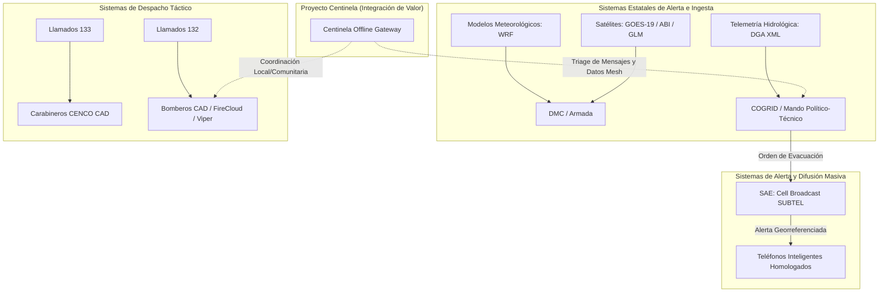
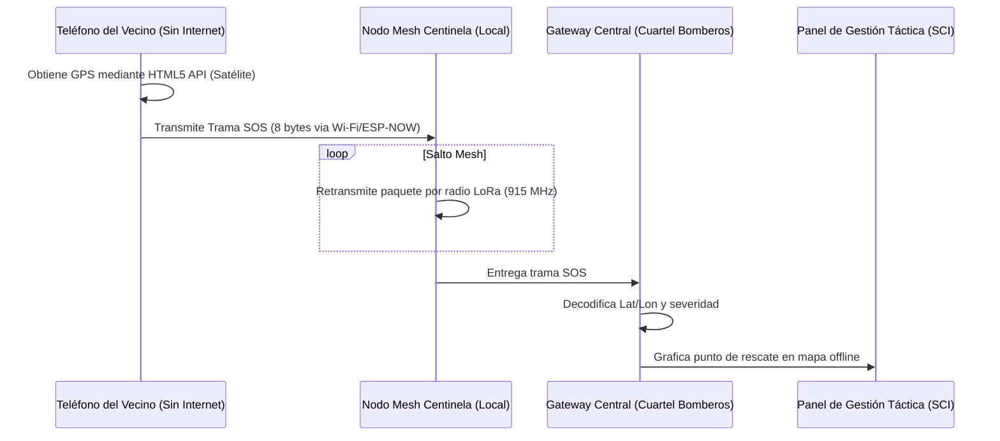

# 🔬 Análisis de Sistemas de Emergencia en Chile e Integración de Proyecto Centinela

Este documento analiza la infraestructura tecnológica de emergencia actual en Chile a partir del documento científico `Sistemas de Emergencia y Monitoreo Tecnológico en Chile.md`. Se evalúan los vacíos críticos del sistema (silos de datos, limitaciones de geolocalización, blackouts de red) y se proponen tres módulos de integración para el **Proyecto Centinela** que agregan valor sin duplicar ni intentar reemplazar los sistemas oficiales del Estado (SENAPRED, Carabineros, Bomberos).

---

## 🏛️ 1. Mapeo del Ecosistema Tecnológico de Emergencias en Chile

El sistema de respuesta chileno (SINAPRED) se compone de múltiples subsistemas que operan con baja interoperabilidad nativa:

### Brechas Tecnológicas Críticas Identificadas
1. **Restricción de Geolocalización Activa (CENCO 133):** Carabineros no puede rastrear instantáneamente las coordenadas del móvil de una persona aislada sin una orden judicial previa o un protocolo largo con la compañía telefónica.
2. **Saturación y Caída de Redes de Telecomunicaciones:** Ante eventos severos (inundación de antenas, cortes de electricidad), los sistemas basados en internet celular (WhatsApp convencional, Instagram, notificaciones push) colapsan. El SAE (Cell Broadcast) sobrevive, pero es unidireccional (de la autoridad al civil).
3. **Fragmentación y Caos en la Información Civil:** La difusión de desaparecidos o de cortes de ruta se realiza mediante redes sociales no oficiales (Instagram/Facebook), generando desinformación, duplicidad de alertas y saturación de los equipos de rescate con información desactualizada.

---

## 💡 2. Evaluación de las Propuestas de Moisés e Integración en Centinela

A continuación, analizamos cómo implementar las tres ideas propuestas por Moisés integrándolas de forma segura en la arquitectura de Centinela.

---

### Propuesta A: Registro Verificado de Personas Desaparecidas (Desacoplamiento de RR.SS.)
* **El Problema:** El uso de Instagram/WhatsApp para reportar desaparecidos provoca "flyers" virales obsoletos que siguen compartiéndose semanas después de que la persona fue encontrada, entorpeciendo las búsquedas reales.
* **Solución Centinela:** Un portal comunitario sumamente ligero y modular que actúe como **Registro Unificado y Temporal de Búsquedas**.
  - **Mecanismo:** El reporte de desaparición genera una ficha con un identificador único en Markdown. Dicha ficha incluye un enlace de verificación firmado por el equipo local de Bomberos o el COGRID comunal (basado en el folio del incidente CAD/SCI).
  - **Prevención de Obsolescencia:** En lugar de compartir imágenes estáticas en redes, se comparte un enlace dinámico corto o código QR. Al escanearlo, el sistema consulta en local (o en la web si hay datos) el estado de la búsqueda: `[ACTIVO / LOCALIZADO CON VIDA / TRANSFERIDO A SALUD]`. Si la persona es hallada, el QR cambia instantáneamente su estado a "Localizado", desactivando el flyer de forma remota.

---

### Propuesta B: Sistema de Búsqueda y Rescate SOS (Geolocalización Offline y Mesh)
* **El Problema:** La incapacidad de CENCO de geolocalizar llamadas de emergencia y la falta de internet en zonas aisladas.
* **Solución Centinela (SOS Localizador):**
  - **Mecanismo:** Un portal web progresivo (PWA) extremadamente liviano (menos de 50 KB) que puede ser transmitido vía Wi-Fi local de emergencia por los repetidores de Centinela (cautivo/offline).
  - **Captura Geográfica:** La aplicación web utiliza el API nativo del navegador `navigator.geolocation` para consultar el hardware GPS interno del teléfono inteligente. Este proceso **no requiere datos móviles ni internet**, funciona puramente por satélite.
  - **Compresión y Envío Mesh:** El sistema codifica las coordenadas (Latitud, Longitud) y el nivel de batería en una trama ultra-comprimida de **8 bytes**:
    $$\text{Trama SOS} = [\text{ID Usuario (2 bytes)} \,\|\, \text{Latitud (3 bytes)} \,\|\, \text{Longitud (3 bytes)}]$$
    Esta trama se transmite saltando a través de la red mesh LoRa/ESP-NOW de Centinela hasta llegar a la central de bomberos o al gateway municipal con enlace satelital, donde el `AlertAgent` grafica la posición en el panel táctico del SCI.

---

### Propuesta C: Mapeo Dinámico y Altitudinal de Rutas Terrestres (Offline Routing)
* **El Problema:** Herramientas comerciales (Google Maps/Waze) quedan obsoletas durante inundaciones repentinas y dependen de conexión a la nube para calcular rutas.
* **Solución Centinela (Offline Map):**
  - **Mecanismo:** Un visualizador cartográfico local precargado con la geografía de la comuna (datos vectoriales de OpenStreetMap y curvas de nivel del terreno).
  - **Rutas Tácticas del SCI:** Los oficiales del Sistema de Comando de Incidentes (SCI) ingresan en la central las novedades de caminos bloqueados (ej: "Colapso Km 499" o "Desborde estero Lambert").
  - **Cálculo de Cotas Seguras:** El algoritmo de enrutamiento calcula trayectorias alternativas priorizando **cotas de altitud seguras** (cálculo trigonométrico de curvas de nivel) y evitando zonas con historial o probabilidad matemática de inundación/aluvión. Este mapa vectorial ligero se transmite a los celulares de los rescatistas a través de la red de radio mesh.

---

## 🎓 3. Relación con el Doble Flujo de Verificación (Base Lógica y Física)

Para justificar estas tres ideas científicamente ante Moisés y sus compañeros expertos, el diseño del SOS y el enrutamiento se fundamentan en principios matemáticos formales sin cálculo infinitesimal:

1. **Compresión Espacial (SOS):** Representación de coordenadas geográficas mediante enteros de 24 bits para reducir el ciclo de trabajo (*Duty Cycle*) de las radios LoRa, garantizando que el mensaje de emergencia pase por canales saturados.
2. **Cálculo Trigonométrico de Rutas Altitudinales:** La selección de rutas de escape seguras se realiza buscando caminos en cotas estables donde el gradiente de inclinación del terreno ($S$) sea menor a la tasa de deslizamiento límite, determinado por álgebra lineal:
   $$S = \tan(\theta) = \frac{\Delta h}{d} < S_{crítico}$$
   Donde $\Delta h$ es la diferencia de altura entre curvas de nivel y $d$ es la distancia horizontal. Si el suelo está saturado por encima de su umbral físico, $S_{crítico}$ disminuye, marcando automáticamente el camino como inestable.

---

## 🔗 Enlaces y Contexto
🔗 [[10_Projects/Proyecto_Centinela/Proyecto_Centinela_OnePager|One-Pager Proyecto Centinela]] | 🔗 [[90_System/Agent_Sync/Active_Context|Contexto Activo]]

---
## 🔗 Conexiones
* [[10_Projects/Proyecto_Centinela/Knowledge/proyecto_centinela|Dashboard Proyecto Centinela]]
* [[Home|Panel de Control Unificado]]
