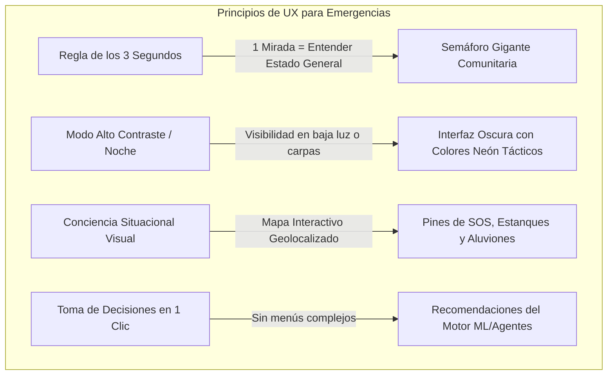

# 🖥️ Diseño del Dashboard Táctico para Puesto de Mando y Bomberos (SCI)

Este documento define la arquitectura de experiencia de usuario (UX), diseño visual e interacción para el **Dashboard Táctico del Puesto de Mando del Proyecto Centinela**, diseñado para ser utilizado por Comandantes de Incidentes (SCI), Bomberos, personal municipal y COGRID durante situaciones de emergencia hidrometeorológica en La Serena.

---

## 🎨 1. Principios de Diseño para Entornos de Crisis (SCI-Friendly)

En un Puesto de Mando (tiendas de campaña, vehículos de telecomunicaciones o cuarteles), las condiciones son caóticas y el tiempo de respuesta es crítico. El diseño sigue 4 reglas fundamentales:



1. **Regla de los 3 Segundos:** El Comandante de Incidentes debe comprender el estado general de la comuna (Verde, Amarillo, Rojo) con una sola mirada a la pantalla, sin leer párrafos de texto.
2. **Modo Alto Contraste / Noche:** Interfaz en tono oscuro profundo (Dark Navy `#0B1325`) con acentos luminosos (Verde `#2ECC71`, Amarillo `#F1C40F`, Rojo `#E74C3C`) para evitar la fatiga visual en operativos nocturnos.
3. **Resiliencia 100% Offline:** Funciona servido desde un servidor web local (FastAPI/Python) en la laptop del Puesto de Mando, sin requerir conexión a internet.
4. **Cero Distracciones:** Tipografía Sans-Serif limpia, números gigantes para los KPIs de riesgo y botones de acción rápida.

---

## 📐 2. Layout y Módulos del Dashboard

El dashboard se organiza en **4 bloques visuales principales**:

```
+-----------------------------------------------------------------------------------+
| 📡 PROYECTO CENTINELA | LA SERENA | ESTADO GENERAL: 🔴 ALERTA ROJA (PUEBLO ISLÓN) |
+---------------------------------------------------+-------------------------------+
| MÓDULO 1: MAPA TÁCTICO INTERACTIVO (LEAFLET)      | MÓDULO 2: KPIS SATELITALES & ML|
|                                                   | - Riesgo ML Desborde: 94%     |
| [ Mapa de La Serena con polígonos de sectores ]   | - Precipitación Sat: 42 mm/h  |
|                                                   | - Isoterma Cero: 3.100 m.n.m. |
|  🔴 Pin SOS: Víctima en Techo (Las Compañías)     | - Saturación Suelo (API): 88% |
|  🟡 Pin Estanque: Plaza La Florida (<15% Agua)    +-------------------------------+
|  🚧 Pin Ruta 5: Socavón / Camino Cortado Km 499   | MÓDULO 3: GRÁFICO PREDICTIVO  |
|                                                   | [ Curva de Cauce vs Lluvia ]  |
+---------------------------------------------------+-------------------------------+
| MÓDULO 4: PANEL DE DECISIONES & RECOMENDACIONES TÁCTICAS (MOTOR AGENTES ML)       |
| 1. ⚠️  EVACUACIÓN PREVENTIVA: Enviar rescate a Pueblo Islón antes de las 18:00 hrs.   |
| 2. 🚰 REABASTECIMIENTO AGUA: Despachar Camión Aljibe N°3 a Estanque Plaza La Florida. |
| [ 📄 GENERAR INFORME SCI-201 (PDF) ]  [ 📢 EMITIR ALERTA PWA ]                    |
+-----------------------------------------------------------------------------------+
```

---

## 🛠️ 3. Descripción Detallada de Módulos

### Módulo 1: Mapa Táctico de Conciencia Situacional
- **Motor Gráfico:** Leaflet / OpenStreetMap embebido localmente.
- **Capas Seleccionables:**
  - *Zonas de Riesgo:* Polígonos de sectores (Pueblo Islón, Las Compañías, Colina El Pino, San Juan) coloreados dinámicamente según el nivel de riesgo del modelo de ML.
  - *Pines de Rescate SOS:* Posición georreferenciada en tiempo real obtenida del GPS satelital nativo del celular de las víctimas (enviado por radio LoRa mesh).
  - *Telemetría de Estanques:* Ubicación de los 100+ estanques estacionarios con indicador visual de volumen restante.
  - *Bloqueos Viales:* Iconos de socavones y vías anegadas.

### Módulo 2: Panel de KPIs Satelitales & ML
- **Score de Riesgo Predictivo ML (%):** Indicador radial gigante ($0\% - 100\%$) que refleja la probabilidad de desborde hidrológico en las próximas 3 a 6 horas.
- **Lluvia Satelital NRT:** Tasa de precipitación instantánea de GOES-19 ($mm/h$).
- **Saturación del Suelo (API):** Porcentaje de agua retenida en la tierra antes del aluvión.
- **Isoterma Cero:** Altitud estimada de congelamiento ($m.n.m.$).

### Módulo 3: Gráfico de Tendencia Predictiva
- Gráfico lineal interactivo (Chart.js / Plotly) que compara el caudal actual del Río Elqui contra la proyección del modelo de ML para las siguientes 6 horas.

### Módulo 4: Asistente Táctico de Decisiones (Motor de Agentes)
- **Generador de Sugerencias Operativas:** El motor de agentes analiza los datos satelitales y predice acciones tácticas de prevención o rescate para el Comandante.
- **Acciones de 1 Clic:**
  - `Generar Formulario SCI-201`: Exporta un informe ejecutivo consolidado en PDF para la reunión del COGRID.
  - `Emitir Alerta Comunitario`: Actualiza la PWA pública con el estado del semáforo.

---

## 💻 4. Stack Tecnológico de Implementación

- **Backend:** FastAPI (Python) que ejecuta en segundo plano los scripts de inferencia `live_inference.py` y los pipelines de datos satelitales.
- **Frontend Web:** HTML5 + Vanilla CSS / Vite + Leaflet.js + Chart.js.
- **Portabilidad:** Empaquetado como una aplicación web local que se inicia ejecutando `python main.py` o mediante un archivo ejecutable en la laptop de Bomberos.

---

## 🔗 Enlaces y Contexto
🔗 [[10_Projects/Proyecto_Centinela/Docs/planificacion_modelo_ml_satelital|Planificación ML Satelital]] | 🔗 [[10_Projects/Proyecto_Centinela/Docs/Proyecto_Centinela_OnePager|One-Pager Proyecto Centinela]] | 🔗 [[90_System/Agent_Sync/Active_Context|Contexto Activo]]
