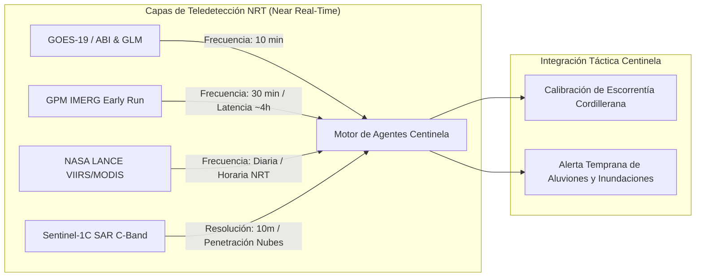

# 📊 Diseño y Estructura de la Presentación en LaTeX (Beamer + TikZ)

Este documento define la planificación previa, objetivos, estructura de 10 diapositivas Beamer, sintaxis conceptual de diagramas **TikZ** e integración del estudio de **Datos Satelitales en Tiempo Real (NRT)** para la presentación del **Proyecto Centinela** ante el equipo de Bomberos y expertos en el Sistema de Comando de Incidentes (SCI).

---

## 🛰️ 1. Análisis del Documento: "Investigación de Datos Satelitales en Tiempo Real.md"

El estudio satelital entrega la base física y de teledetección que complementa a los sensores terrestres de Centinela, permitiendo **anticipar temporales antes de que la lluvia toque la cuenca alta**:



### Hallazgos Clave para el Proyecto Centinela:
1. **GOES-19 (ABI & GLM - NOAA):**
   - Operativo desde abril de 2025. El algoritmo **RRQPE** provee la tasa de precipitación instantánea cada **10 minutos** a ~2km de resolución.
   - El detector óptico de rayos **GLM** permite mapear frentes convectivos fríos y tormentas eléctricas en tiempo casi real, dando la primera señal de alerta extrema.
2. **GPM IMERG Early Run (NASA / JAXA):**
   - Fusiona sensores de microondas pasivas a $0.1^\circ$ (~10km) cada **30 minutos** con latencia de **~4 horas**.
   - Ideal para estimar el agua acumulada en alta cordillera (sobre la isoterma cero) e ingresarla como parámetro al modelo de escorrentía rápida de Centinela.
3. **NASA LANCE (VIIRS / MODIS Flood Products):**
   - Mapas NRT de inundación a 250m de resolución. El sensor VIIRS (NOAA-20/21) permite rastrear la evolución del desborde de cuencas continentales en acumulados horarios.
4. **Sentinel-1C (ESA SAR C-Band):**
   - Radar de apertura sintética que atraviesa la cobertura nubosa completa. Proporciona delimitación exacta de cuerpos de agua e inundaciones a **10 metros de resolución espacial**.

---

## 🎯 2. Objetivos y Audiencia de la Presentación

- **Audiencia:** 2 Amigos Bomberos (Expertos en Sistema de Comando de Incidentes - SCI, ex-compañeros de 6ª Compañía de La Serena).
- **Propósito:** Demostrar que Centinela es una herramienta **complementaria, pragmática, de bajo costo ($305 USD) y 100% resiliente offline**, diseñada para optimizar la toma de decisiones pre y post desastre.
- **Tono:** Técnico, riguroso, empírico (basado en el Temporal de La Serena de Julio 2026) y orientado a la operativa de rescate.

---

## 📑 3. Estructura Proyectada de Diapositivas (10 Slides en Beamer)

1. **Slide 1: Portada Táctica**
   - Título: *Proyecto Centinela: Ecosistema Abierto de Alerta Temprana y Respuesta Resiliente*.
   - Subtítulo: *Monitoreo IoT, Teledetección Satelital y Redes Mesh Offline en Sectores Rurales*.
2. **Slide 2: El Diagnóstico Real (La Serena, Julio 2026)**
   - Lecciones de la catástrofe: Colapso de rutas (Km 499), falla de red celular, 104 mil aislados, destrucción en Pueblo Islón.
3. **Slide 3: Arquitectura General de 3 Capas (Sim2Real)**
   - Visión integrada: Capa de Captura (IoT + Satélites NRT) $\rightarrow$ Motor Predictivo $\rightarrow$ Capa de Conciencia Situacional.
4. **Slide 4: Capa Satelital NRT (GOES-19, GPM IMERG & NASA LANCE)**
   - Cómo alimentamos el modelo con datos orbitales de 10 min (GOES-19) y 30 min (GPM Early Run) para calcular la escorrentía en cordillera.
5. **Slide 5: Fase Pre-Desastre: Sensores IoT y Red Mesh (915 MHz)**
   - Nodos de $35 USD (ESP32 + JSN-SR04T), empaquetado binario de 4 bytes para LoRa, resistencia energética solar.
6. **Slide 6: Fase Post-Desastre I: SOS GPS Offline HTML5**
   - Captura de GPS satelital nativo en PWA sin datos móviles. Trama de 6 bytes enviada por radio mesh $\rightarrow$ **Mapa de Calor SCI**.
7. **Slide 7: Fase Post-Desastre II: Reagrupación Familiar & QR Dinámico**
   - Single Source of Truth (SSOT). Verificación en albergues/salud que invalida afiches obsoletos y frena las fake news.
8. **Slide 8: Fase Post-Desastre III: Logística de Agua y Routing por Cotas**
   - Telemetría ultrasónica en estanques comunitarios y algoritmo de enrutamiento táctico evitando quebradas inundables.
9. **Slide 9: Interoperabilidad con el Ecosistema Chileno**
   - Enlace conceptual con radio digital P25, software CAD (Viper, FireCloud), telemetría DGA y visores de SENAPRED.
10. **Slide 10: Hoja de Ruta & Próximos Pasos**
    - Fase 0 (Validación SCI) $\rightarrow$ Fase 1 (Simulador Python Sim2Real) $\rightarrow$ Pruebas de Campo en terreno.

---

## 🎨 4. Esquema de Diagramas Ilustrativos en TikZ

Para ilustrar de forma abstracta e impactante los flujos de datos en Beamer, utilizaremos **TikZ**:

### Diagrama TikZ 1: Flujo Completo del Sistema (Pre y Post Desastre)
```tikz
\begin{tikzpicture}[node distance=1.5cm, auto, >=stealth']
  % Estilos
  \tikzstyle{sensor} = [rectangle, draw=blue!80, fill=blue!10, thick, minimum size=8mm, rounded corners]
  \tikzstyle{sat} = [rectangle, draw=purple!80, fill=purple!10, thick, minimum size=8mm, rounded corners]
  \tikzstyle{core} = [rectangle, draw=orange!80, fill=orange!20, thick, minimum size=10mm, rounded corners]
  \tikzstyle{output} = [rectangle, draw=green!80, fill=green!10, thick, minimum size=8mm, rounded corners]
  
  % Nodos
  \node [sensor] (lora) {Sensores IoT / Mesh 915MHz};
  \node [sat, right of=lora, node distance=4cm] (satelites) {Satélites NRT (GOES-19 / GPM)};
  \node [core, below of=lora, xshift=2cm] (engine) {Motor Centinela (Python / Scikit-Learn)};
  \node [output, below of=engine, xshift=-2cm] (sci) {Puesto Mando SCI (Bomberos)};
  \node [output, below of=engine, xshift=2cm] (comunidad) {Portal Comunitario / Semáforo};

  % Enlaces
  \draw[->, thick] (lora) -- (engine);
  \draw[->, thick] (satelites) -- (engine);
  \draw[->, thick] (engine) -- (sci);
  \draw[->, thick] (engine) -- (comunidad);
\end{tikzpicture}
```

### Diagrama TikZ 2: Estructura de Trama Binaria LoRa (4-6 Bytes)
```tikz
\begin{tikzpicture}[font=\sffamily\small]
  \draw[fill=blue!20, thick] (0,0) rectangle (2,1) node[pos=.5] {ID Nodo (1B)};
  \draw[fill=green!20, thick] (2,0) rectangle (5,1) node[pos=.5] {Nivel / GPS Lat (2B)};
  \draw[fill=yellow!20, thick] (5,0) rectangle (8,1) node[pos=.5] {GPS Lon (2B)};
  \draw[fill=red!20, thick] (8,0) rectangle (10,1) node[pos=.5] {Estado SCI (1B)};
\end{tikzpicture}
```

---

## 🏙️ 5. Casos de Uso Concretos Adaptados a la Geografía de La Serena

Dado el gran tamaño y la diversidad geográfica de La Serena (zona urbana costera, valles rurales interiores, quebradas inactivas y rutas troncales), se definen 3 casos de uso específicos que ilustran el funcionamiento real del sistema:

### Caso 1: Pre-Desastre / Evacuación Preventiva en Pueblo Islón y Quebrada Santa Gracia
* **Geografía:** Sector rural oriente de La Serena (Lambert / Pueblo Islón).
* **Escenario:** Precipitación de 45 mm/h en precordillera con alta isoterma cero.
* **Operación Centinela:**
  1. *Captura Combinada:* GOES-19 detecta la intensidad convectiva y el sensor ultrasónico ($35 USD) en el puente Lambert mide un aumento de caudal de 1.8 metros en 20 minutos.
  2. *Predicción Scikit-Learn:* El modelo calcula un 94% de probabilidad de desborde y aluvión en Pueblo Islón en las siguientes 2.5 horas.
  3. *Respuesta Táctica:* Se envía la trama LoRa de 4 bytes a la Central de Bomberos (6ª Compañía) y se activa el semáforo comunitario PWA. Bomberos posiciona rescatistas e inicia evacuación preventiva a las 18:00 hrs (de día), evitando rescates a ciegas en techos durante la noche.

### Caso 2: Post-Desastre / Rescate de Víctimas Aisladas en Las Compañías / El Islón (Blackout Celular)
* **Geografía:** Valles y sectores aislados del norte de La Serena tras caída total de antenas 4G y red eléctrica.
* **Escenario:** Lunes 03:00 AM. 15 personas atrapadas en techos y 90 aisladas sin agua; líneas telefónicas 133/132 caídas o inalcanzables.
* **Operación Centinela:**
  1. *SOS PWA Offline:* Las víctimas conectan su celular a la red Wi-Fi de emergencia emitida por el nodo repetidor de Centinela en la escuela o sede vecinal.
  2. *GPS Satelital Nativo:* La WebApp captura las coordenadas GPS satelitales (`lat, lon`) sin requerir internet y el usuario selecciona: `🔴 ROJO - Atrapado en Techo`.
  3. *Trama de 6 Bytes por Radio Mesh:* Viaja por saltos LoRa hasta la Central en el centro de La Serena.
  4. *Priorización SCI:* El comandante visualiza un **Mapa de Calor de Rescate** con pines exactos (ej. `-29.8912, -71.2145`). Se despacha el bote de rescate directamente a la coordenada con riesgo vital, evitando registrar a pie los 15 km de quebrada.

### Caso 3: Post-Desastre / Routing Táctico y Telemetría de Estanques de Agua Potable (La Serena Urbana)
* **Geografía:** Sectores urbanos altos (La Florida, Colina El Pino, San Juan) y conectividad troncal en Ruta 5 Norte (Km 499).
* **Escenario:** Corte masivo de agua potable por turbiedad en el río Elqui (Aguas del Valle). Alud en Km 499 bloquea la calzada principal. 100 estanques plásticos instalados en la comuna.
* **Operación Centinela:**
  1. *Telemetría de Estanques:* Sensores ultrasónicos de $10 USD miden el volumen restante. Al bajar del 15% en el estanque de Plaza La Florida, envía una alerta LoRa automática a la Central Municipal de Agua.
  2. *Waze Táctico Offline por Cotas:* Los camiones aljibe reciben la ruta óptima en tabletas offline. El algoritmo esquiva la Ruta 5 cortada y pasos desnivelados anegados por debajo de la cota 15 m.n.m., reabasteciendo el tanque antes de que se agote.
  3. *Reagrupación por QR Dinámico:* El personal municipal en el albergue del Liceo Gabriela Mistral registra a los evacuados. Las familias escanean el QR compartido en redes y ven de inmediato: `ENCONTRADO - Albergue Liceo Gabriela Mistral (ESTABLE)`.

---

## 🔗 Enlaces y Contexto
🔗 [[10_Projects/Proyecto_Centinela/Docs/Proyecto_Centinela_OnePager|One-Pager Proyecto Centinela]] | 🔗 [[10_Projects/Proyecto_Centinela/Docs/Investigación de Datos Satelitales en Tiempo Real|Investigación Satelital NRT]] | 🔗 [[90_System/Agent_Sync/Active_Context|Contexto Activo]]


---
## 🔗 Conexiones
* [[10_Projects/Proyecto_Centinela/Knowledge/proyecto_centinela|Dashboard Proyecto Centinela]]
* [[Home|Panel de Control Unificado]]
