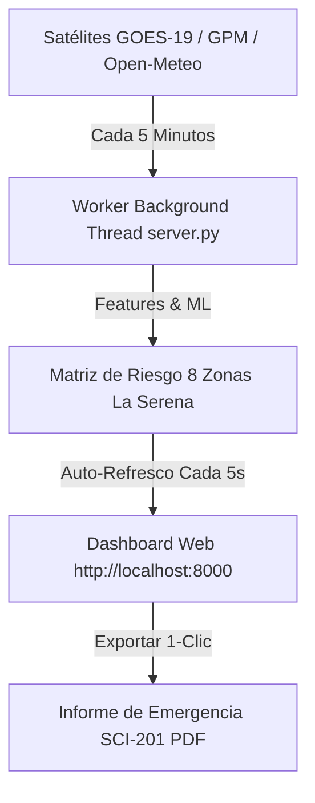

# 🌧️ Guía de Operación: Prueba en Vivo durante el Evento de Lluvias de este Viernes

Este documento establece la **Guía Operativa de Terreno** para poner a prueba el primer prototipo funcional del **Proyecto Centinela** durante el frente de precipitaciones pronosticado para este **Viernes en La Serena y la Región de Coquimbo**.

---

## ⚙️ 1. Configuración del Servidor y Tasa de Ingesta NRT (5 Minutos)

El servidor ha sido configurado para ejecutar una **tarea en segundo plano cada 5 minutos (300 segundos)** que descarga los datos satelitales NRT y recalcula la matriz de riesgo para las 8 zonas de La Serena.



---

## 📋 2. Pasos de Operación para este Viernes

### **Paso A: Iniciar la Plataforma en la Laptop**
1. Abrir la terminal y navegar a la carpeta del Dashboard:
   ```bash
   cd "/mnt/9b846436-0407-4e80-b8af-5417ffbdee8e/ObsidianVault/10_Projects/Proyecto_Centinela/Dashboard"
   ```
2. Ejecutar el servidor web local:
   ```bash
   python3 server.py
   ```
3. Abrir el navegador e ingresar a: **`http://localhost:8000`**.

---

### **Paso B: Pauta de Verificación durante la Tormenta del Viernes**

| Hora de Evaluación | Qué Observar en el Dashboard | Qué Verificar en Terreno con Bomberos |
| :---: | :--- | :--- |
| **08:00 AM (Inicio Frente)** | Confirmar que la tasa de refresco muestra `SISTEMA EN VIVO NRT (DESCARGA: CADA 5 MIN)`. | Comparar la tasa de lluvia $mm/h$ del Dashboard con las observaciones visuales del cielo y reportes radiales. |
| **12:00 PM (Pico Lluvia)** | Revisar si la Isoterma Cero sube de los $3.000 \text{ m.n.m.}$ y si el sector **Pueblo Islón / Quebrada Santa Gracia** pasa a `AMARILLO` o `ROJO`. | Consultar con Bomberos si hay aumento de caudal en el Río Elqui o quebradas. |
| **16:00 PM (Acumulado 24h)** | Verificar el Semáforo de **Pasos Bajo Nivel en Ruta 5 Km 490-500** y **Las Compañías**. | Confirmar anegamientos viales reportados en redes/radios contra la predicción del Dashboard. |

---

### **Paso C: Generación de Informe Oficial SCI-201 (PDF)**
Si durante la lluvia de este viernes el Comandante de Incidentes o la municipalidad solicita un reporte consolidado:
1. Hacer clic en el botón superior: **`📄 Generar Informe SCI-201 (PDF)`**.
2. Guardar o imprimir el PDF resumen con los 4 KPIs, el mapa de zonas y las recomendaciones tácticas.

---

## 🔗 Enlaces y Contexto
🔗 [[10_Projects/Proyecto_Centinela/Docs/diseno_dashboard_puesto_mando|Diseño Dashboard Táctico]] | 🔗 [[10_Projects/Proyecto_Centinela/Docs/planificacion_modelo_ml_satelital|Planificación ML Satelital]] | 🔗 [[90_System/Agent_Sync/Active_Context|Contexto Activo]]
