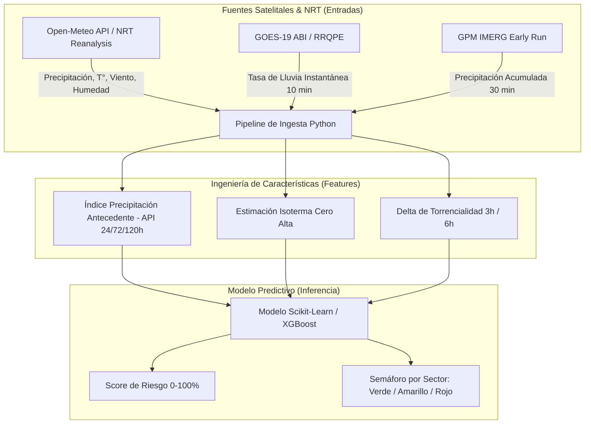
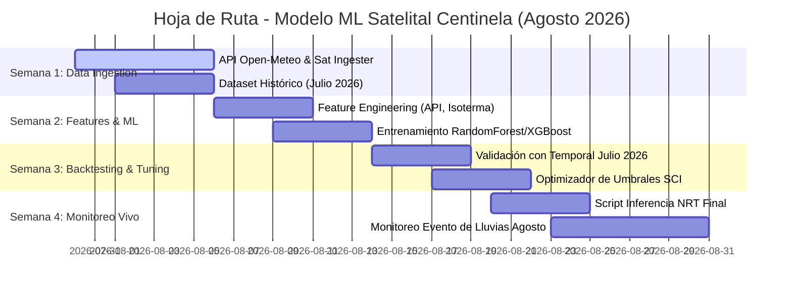

# 🧠 Planificación del Modelo de Machine Learning Satelital (Pruebas Agosto 2026)

Este documento establece la hoja de ruta técnica, arquitectura de datos y estrategia de validación para el desarrollo del **Modelo de Machine Learning de Alerta Temprana del Proyecto Centinela**, basado **exclusivamente en datos satelitales y teledetección NRT (Near Real-Time)**, diseñado para ser probado durante los eventos de lluvias extremas proyectados para **finales de agosto de 2026** en La Serena y la Región de Coquimbo.

---

## 🎯 1. Contexto y Decisión Estratégica (Feedback Bomberos)

Tras la reunión con el equipo de Bomberos y expertos en el Sistema de Comando de Incidentes (SCI):
1. **Validación del Concepto:** Se confirmó que la solución es inédita a nivel local en La Serena y ataca los problemas críticos de prevención y gestión de emergencias.
2. **Pivote Operacional Temporal:** Debido a la urgencia de probar la herramienta en las lluvias intensas de **finales de agosto de 2026** y a la falta de sensores físicos IoT desplegados en terreno, el modelo se construirá **100% analizando datos satelitales NRT y teledetección abierta**.
3. **Plazo de Ejecución:** ~3 a 4 semanas de desarrollo e integración antes de la llegada del frente de mal tiempo.

---

## 🛰️ 2. Fuentes de Datos Satelitales y Meteorológicos NRT



### Variables de Entrada del Modelo ($X$):
1. **Precipitación Acumulada Móvil:** 1h, 3h, 6h, 12h, 24h, 72h y 120h ($mm$).
2. **Índice de Precipitación Antecedente (API):** $API_t = P_t + k \cdot API_{t-1}$ (mide saturación previa del suelo).
3. **Tasa de Lluvia Instantánea Satelital (GOES-19 RRQPE):** $mm/h$.
4. **Isoterma Cero Estimada:** Altitud ($m.n.m.$) para prever escorrentía líquida en alta cordillera.
5. **Velocidad y Ráfagas de Viento:** $km/h$ (para estimación indirecta de riesgo de caídas).

### Variables de Salida ($Y$):
- **Continuous Overflow Risk Score ($0.0 - 1.0$):** Probabilidad de desborde/aluvión en cuencas críticas (Río Elqui y Quebrada Santa Gracia/Pueblo Islón).
- **Semáforo Táctico SCI:** `VERDE` (Estable), `AMARILLO` (Preparación/Pre-alerta), `ROJO` (Evacuación/Riesgo Inminente).

---

## 🗓️ 3. Cronograma de Desarrollo (4 Semanas)



---

## 🛠️ 4. Arquitectura de Archivos en `/ML_Models/`

```
ML_Models/
├── data/
│   ├── raw/                 # Archivos CSV/JSON de descargas de Open-Meteo y Satélites
│   └── processed/           # Datasets procesados con features calculadas
├── src/
│   ├── ingesters/           # ingester_open_meteo.py, ingester_goes19.py
│   ├── features/            # feature_engineering.py
│   ├── models/              # train_model.py, evaluate_model.py
│   └── inference/           # run_live_prediction.py
├── trained_models/          # centinela_floods_v1.joblib
└── requirements.txt         # pandas, numpy, scikit-learn, xgboost, joblib, requests
```

---

## 🧪 5. Criterios de Éxito para las Pruebas de Agosto

1. **Backtesting Exitoso:** Al correr el modelo con los datos del 19 de julio de 2026 (aluvión de Pueblo Islón), el modelo debe haber marcado `ROJO` con **al menos 3 horas de anticipación**.
2. **Cero Fallos de Memoria:** Inferencia ejecutable en CPU con consumo $<100$ MB de RAM y tiempo de respuesta $<1$ segundo.
3. **Evaluación en Tiempo Real en Agosto:** Generar reportes diarios/horarios durante el evento de finales de agosto, comparando las alertas del modelo contra lo observado en terreno por Bomberos.

---

## 🔗 Enlaces y Contexto
🔗 [[10_Projects/Proyecto_Centinela/Docs/Proyecto_Centinela_OnePager|One-Pager Proyecto Centinela]] | 🔗 [[10_Projects/Proyecto_Centinela/Docs/Estudio_Caso_La_Serena_Lluvias|Estudio Caso La Serena]] | 🔗 [[90_System/Agent_Sync/Active_Context|Contexto Activo]]
