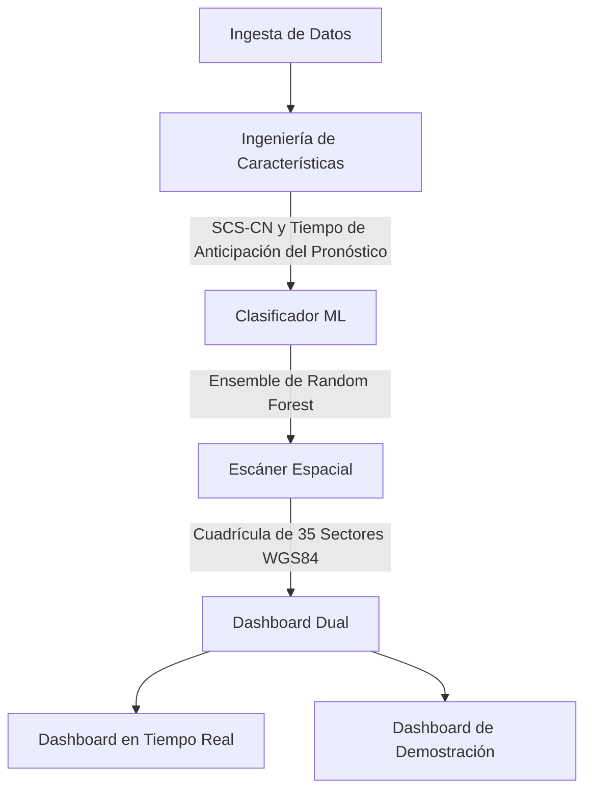

# ⚡ Proyecto Júpiter: Sistema de Alerta Temprana e Inteligencia Hidrometeorológica

Inspirado en Júpiter Pluvio (dios romano de la lluvia y las nubes). Este proyecto es un sistema de alerta temprana e inteligencia hidrometeorológica en tiempo real para La Serena, Chile, utilizando datos satelitales.

## Arquitectura del Sistema



## Detalles de Machine Learning (Aprendizaje Automático)
El sistema utiliza un enfoque de Machine Learning para la predicción de inundaciones:
- **Características**: Incluye varios parámetros hidrometeorológicos.
- **Modelo**: Ensemble de Random Forest (Bosque Aleatorio) para una clasificación robusta.
- **Hidrología**: Integra la fórmula hidrológica SCS-CN (Curve Number o Número de Curva del Servicio de Conservación de Suelos) para la estimación de escorrentía.
- **Estimaciones de Tiempo (Lead Time Forecast)**: 
  - Pronósticos de anticipación extendida de +1h, +3h, +6h y +12h.
  - Calcula la **Llegada del Pico** (ETA Peak - tiempo estimado para la inundación máxima).
  - Calcula la **Hora de Paso Seguro / Calma** (ETA Clearance - cuando las aguas retroceden a niveles seguros).

## Guía de Instalación y Ejecución Local

1. Clonar el repositorio.
2. Instalar las dependencias (por ejemplo, `pip install -r requirements.txt`).
3. Ejecutar el servidor:
   ```bash
   python3 server.py
   ```
4. Acceder a los paneles de control (dashboards):
   - Tiempo Real: `http://localhost:8000/`
   - Demostración: `http://localhost:8000/demo`

## Suite de PyTest
Para ejecutar las pruebas automatizadas (automated tests):
```bash
pytest tests/ -v
```
