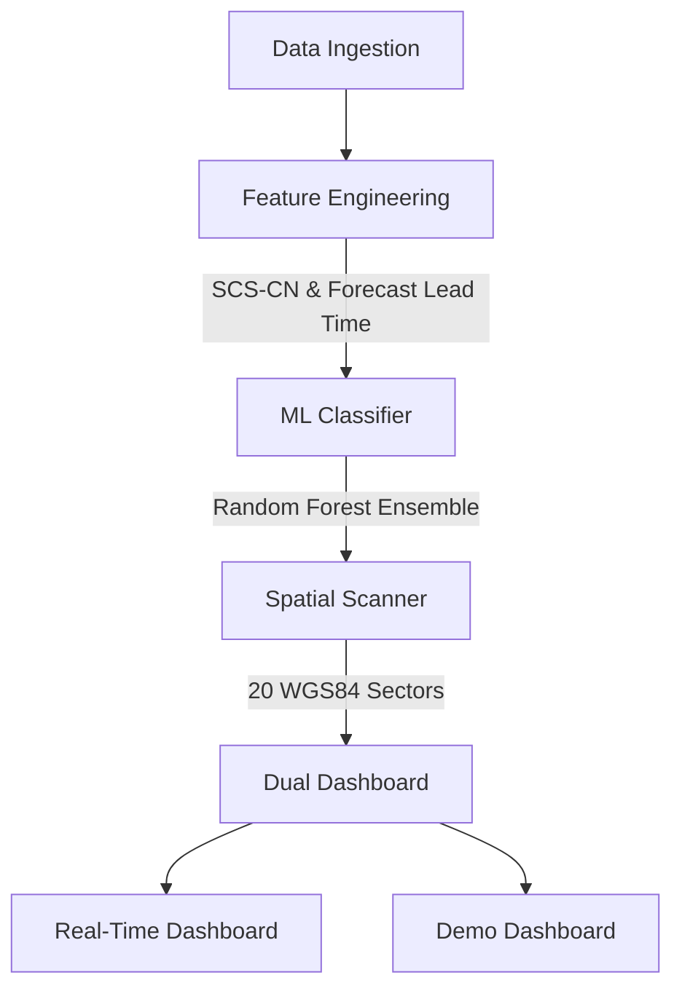

# Proyecto Centinela

Real-time satellite & hydrometeorological early warning system for La Serena, Chile.

## System Architecture



## Machine Learning Details
The system utilizes a Machine Learning approach for flood prediction:
- **Features**: Includes various meteorological and hydrological parameters.
- **Model**: Random Forest ensemble for robust classification.
- **Hydrology**: Integrates the SCS-CN (Soil Conservation Service Curve Number) formula for runoff estimation.
- **Timing Estimations**: Calculates ETA of Peak (estimated time to maximum flood) and ETA of Safe Return (Calma).

## Installation & Local Run

1. Clone the repository.
2. Install dependencies (e.g., `pip install -r requirements.txt`).
3. Run the server:
   ```bash
   python3 server.py
   ```
4. Access the dashboards:
   - Real-Time: `http://localhost:8000/`
   - Demo: `http://localhost:8000/demo`

## PyTest Suite
To run the automated tests:
```bash
pytest tests/ -v
```
