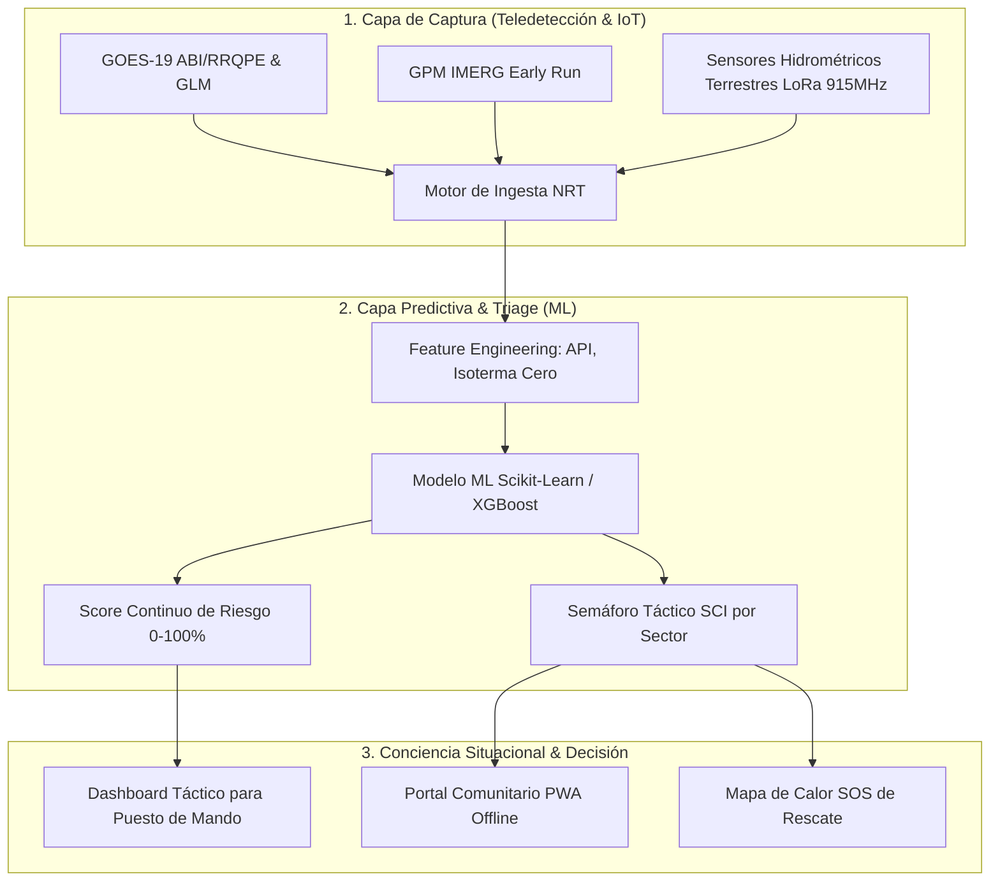

# 📡 Proyecto Centinela: Ecosistema Abierto de Alerta Temprana y Resiliencia en Emergencias

[](LICENSE)
[]()
[]()

**Proyecto Centinela** es una plataforma abierta e integrada de **monitoreo hidrometeorológico, prevención y conciencia situacional en tiempo real**, diseñada para operar antes, durante y después de crisis climáticas en zonas rurales y valles aislados.

---

## 🎯 Misión

Combinar teledetección satelital en tiempo casi real (GOES-19, GPM IMERG, Sentinel-1C, NASA LANCE), modelos predictivos de Machine Learning deterministas y redes de comunicación resilientes offline (LoRa Mesh / PWA) para dotar a los **Puestos de Mando de Bomberos, COGRID y Municipios** de herramientas de decisión rápida de bajo costo.

---

## 🏗️ Arquitectura de 3 Capas



---

## 🚀 Hoja de Ruta (Hito Agosto 2026)

- [x] **Fase 0:** Validación conceptual y alineación con expertos en Sistema de Comando de Incidentes (SCI) de Bomberos de La Serena.
- [x] **Investigación Satelital:** Mapeo de fuentes NRT (GOES-19, GPM IMERG, Open-Meteo, NASA LANCE).
- [/] **Fase 1 (En Desarrollo - Agosto 2026):** Desarrollo e ingeniería de características del **Modelo de Machine Learning Satelital** para pruebas reales durante los temporales de finales de agosto en La Serena.
- [ ] **Fase 2:** Implementación del Dashboard Táctico interactivo para Puesto de Mando (Bomberos / COGRID).
- [ ] **Fase 3:** Prototipado físico de sensores IoT hidrométricos (ESP32 / LoRa 915 MHz).

---

## 📁 Estructura del Repositorio

```
Proyecto-Centinela/
├── Docs/                    # Documentación técnica, estudios de caso y guías
│   ├── Proyecto_Centinela_OnePager.md
│   ├── analisis_sistemas_emergencia.md
│   ├── analisis_post_desastre_tecnologia.md
│   ├── planificacion_modelo_ml_satelital.md
│   └── presentacion_centinela.pdf
├── ML_Models/               # Módulos de Machine Learning
│   ├── data/                # Datasets raw y procesados
│   ├── src/                 # Ingestion, Feature Engineering, Training, Inference
│   └── trained_models/      # Modelos serializados (.joblib)
├── Simulador/               # Entorno de simulación virtual Sim2Real
├── Agents/                  # Suite de agentes de decisión
└── README.md
```

---

## 👤 Autor & Contacto

- **Moisés Amundarain** — *Creador e Investigador Principal* (Estudiante de Ing. Civil Informática, Universidad San Sebastián).
- **Colaboradores:** Equipo de Bomberos y Expertos en SCI (La Serena).
