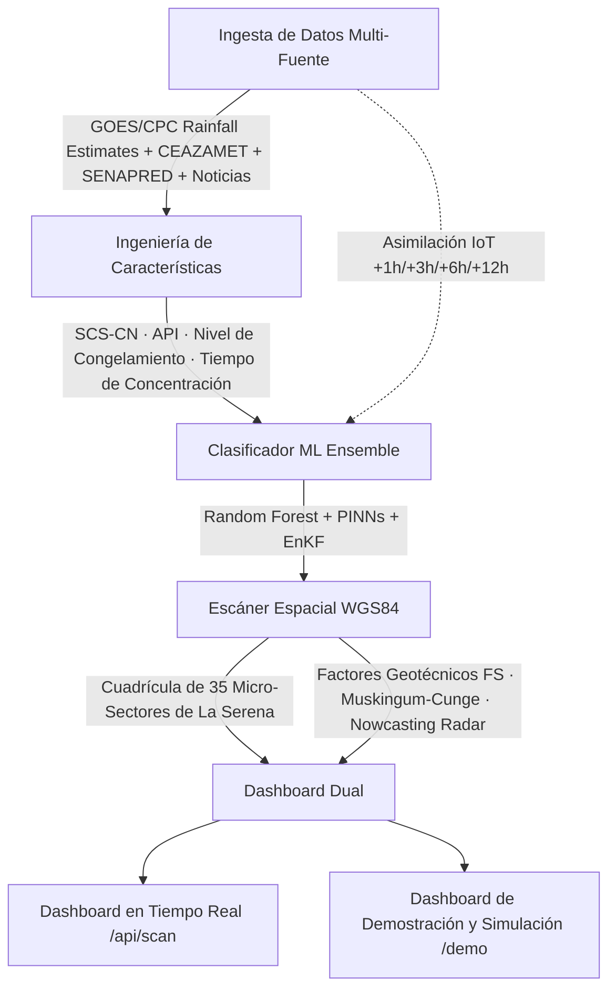

# ⚡ Proyecto Júpiter — Sistema de Alerta Temprana e Inteligencia Hidrometeorológica

<p align="center">
  
  
  
  
  
</p>

**Proyecto Júpiter** es un sistema de alerta temprana e inteligencia hidrometeorológica en tiempo real orientado a la comuna de **La Serena, Chile**. Inspirado en *Júpiter Pluvio* — dios romano de la lluvia y las nubes — integra telemetría satelital de última generación, ciencia hidrológica y Machine Learning para anticipar inundaciones, aluviones y cortes de ruta con un detalle táctico de **35 micro-sectores georreferenciados**.

## 🎯 Misión

Reducir el tiempo de reacción de Bomberos, organismos del Sistema de Comando de Incidentes (SCI) y autoridades comunales ante eventos hidrometeorológicos extremos, mediante conciencia situacional predictiva a nivel de micro-sector: *qué sector, en qué momento y con qué severidad* será impactado.

## 🏗️ Arquitectura del Sistema



### Módulos de la Arquitectura v6.0

1. **Nowcasting Radar (dBZ → mm/h):** estimación a muy corto plazo mediante la relación Marshall-Palmer.
2. **Factor de Seguridad Geotécnico (FS):** estabilidad de laderas con el modelo de talud infinito dependiente de saturación.
3. **Enrutamiento Hidrológico Muskingum-Cunge:** propagación de onda cinemática de caudales entre micro-zonas.
4. **Restricciones Físicas Informadas (PINNs):** ecuaciones de conservación de masa de Saint-Venant como restricciones del modelo.
5. **Asimilación de Datos (EnKF):** Filtro de Kalman por Ensambles para calibrar estados con sensores IoT y estaciones en tierra (CEAZAMET).

## 🧭 Detalle de los 35 Micro-Sectores WGS84

El escáner espacial divide la comuna y su hinterland en **35 micro-sectores WGS84**, cada uno con tipo de amenaza, tiempo de concentración, curva SCS-CN, elevación y coeficientes de ponderación de riesgo.

| # | Sector | Lat | Lon | Tipo / Amenaza |
|---|--------|-----|-----|----------------|
| 01 | Pueblo Islón / Quebrada Santa Gracia | -29.878 | -71.218 | Precordillera / Aluvión |
| 02 | Lambert & Acceso Minero Norte | -29.818 | -71.148 | Precordillera / Aluvión |
| 03 | El Brillador & Quebrada Norte | -29.825 | -71.175 | Cerros / Escorrentía rápida |
| 04 | Santa Gracia Alta / Pelícano | -29.785 | -71.130 | Alta precordillera / Aluvión |
| 05 | Las Rojas & Entrada Precordillera | -29.970 | -71.055 | Valle / Aluvión y corte Ruta D-41 |
| 06 | Algarrobito / Gabriela Mistral / Quebrada Talca | -29.960 | -71.120 | Valle ribereño / Crecida |
| 07 | Altovalsol & Valle Medio | -29.945 | -71.165 | Rural ribereño / Crecida |
| 08 | Coquimbito / Bellavista / Pan de Azúcar Norte | -29.955 | -71.185 | Agrícola periurbano / Apozamiento |
| 09 | Las Compañías (Alta y Villa Lambert) | -29.860 | -71.240 | Urbano denso / Aislamiento |
| 10 | Las Compañías (Baja y Esmeralda) | -29.875 | -71.245 | Urbano denso / Anegamiento vial |
| 11 | Ribereño Norte (Puentes Libertador / Zorrilla) | -29.888 | -71.250 | Urbano ribereño / Desborde Río Elqui |
| 12 | Caleta San Pedro & Borde Norte | -29.855 | -71.275 | Costero / Marejadas |
| 13 | Centro Histórico & Damero Comercial | -29.902 | -71.252 | Urbano denso / Colectores |
| 14 | Eje Av. Fco. de Aguirre / Amunátegui / Mall Plaza | -29.908 | -71.256 | Eje comercial / Colectores |
| 15 | La Pampa & Eje Av. Balmaceda | -29.920 | -71.245 | Urbano residencial / Anegamiento |
| 16 | El Milagro & San Joaquín | -29.930 | -71.230 | Terraza media / Escorrentía |
| 17 | Cerro Grande & Faldeos Este | -29.940 | -71.210 | Ladera / Deslizamiento |
| 18 | Avenida del Mar & Borde Costero Sur | -29.910 | -71.275 | Borde costero / Inundación costera |
| 19 | La Florida / Aeródromo | -29.915 | -71.220 | Urbano / Anegamiento |
| 20 | Ruta 5 Norte & Pasos Bajo Nivel (Km 490-500) | -29.890 | -71.260 | Arteria crítica / Corte de Ruta 5 |
| 21 | El Molle & Quebradas | -29.978 | -70.923 | Valle precordillerano / Aluvión |
| 22 | Marquesa & Río Claro | -29.967 | -70.963 | Valle / Desborde Río Claro |
| 23 | Acceso Vicuña / Ruta 41 Alta | -30.030 | -70.710 | Arteria precordillera / Corte |
| 24 | Sector Peñuelas & Ruta 5 Sur | -29.950 | -71.270 | Urbano costero / Anegamiento |
| 25 | Corredor Guanaqueros | -30.198 | -71.423 | Costero sur / Corte de ruta |
| 26 | Acceso Tongoy / Quebrada Seca | -30.250 | -71.490 | Costero sur / Inundación |
| 27 | Cerro Juan Soldado & Norte | -29.680 | -71.280 | Cerros costa norte / Escorrentía |
| 28 | Punta Teatinos & Humedal | -29.820 | -71.275 | Humedal costero / Desborde |
| 29 | Quebrada El Arrayán Costero | -29.740 | -71.300 | Quebrada norte / Aluvión |
| 30 | Ruta D-43 / Acceso Andacollo | -30.100 | -71.180 | Ruta precordillera / Corte |
| 31 | Acceso Condoriaco / Ruta D-205 | -29.690 | -70.950 | Rural interior / Aislamiento |
| 32 | Totoralillo & Las Tacas | -30.060 | -71.320 | Borde costero sur / Anegamiento |
| 33 | Pan de Azúcar Sur | -30.010 | -71.200 | Agrícola periurbano / Apozamiento |
| 34 | Borde Embalse Puclaro | -30.010 | -70.830 | Infraestructura crítica / Crecida |
| 35 | La Herradura Oriente / Sindempart | -29.980 | -71.350 | Urbano residencial sur / Colectores |

## 🚀 Guía de Instalación y Uso

### Requisitos

- **Python ≥ 3.10** (desarrollado y verificado sobre Python 3.13)
- **pip** / **venv**

### Ejecución Local

```bash
# Clonar el repositorio público del proyecto y entrar al directorio
git clone <url-repositorio>
cd <directorio-del-proyecto>

# Entorno virtual
python3 -m venv .venv
source .venv/bin/activate

# Dependencias (modelo + API)
pip install -r ML_Models/requirements.txt
pip install -r Dashboard/requirements.txt

# Suite de pruebas automatizadas (38 tests)
pytest ML_Models/tests/ -v

# Servidor local del Dashboard Táctico
python3 Dashboard/server.py
```

Accesos:
- Dashboard en Tiempo Real: `http://localhost:8000/`
- Dashboard de Demostración y Simulación: `http://localhost:8000/demo`
- API de Escaneo Espacial: `GET http://localhost:8000/api/scan`
- Boletín de Emergencia: `GET http://localhost:8000/api/bulletin`
- Simulación de Tormenta: `GET http://localhost:8000/api/simulate-storm?severity=extreme`

### Ejecución con Docker

```dockerfile
FROM python:3.13-slim
WORKDIR /app
COPY ML_Models/requirements.txt /app/requirements.txt
RUN pip install --no-cache-dir -r /app/requirements.txt \
    fastapi>=0.110.0 uvicorn>=0.28.0
COPY ML_Models /app/ML_Models
COPY Dashboard /app/Dashboard
EXPOSE 8000
CMD ["uvicorn", "app.Dashboard.server:app", "--host", "0.0.0.0", "--port", "8000"]
```

```bash
docker build -t proyecto-jupiter .
docker run -p 8000:8000 proyecto-jupiter
# → http://localhost:8000/api/scan
```

## 🤖 Machine Learning: Modelo y Características

- **Características:** precipitación acumulada 24h/6h, API (índice de precipitación antecedente 72h), nivel de congelamiento, SCS-CN, tiempo de concentración por micro-sector, telemetría CEAZAMET y comunicados SENAPRED.
- **Modelo:** Ensemble de **Random Forest** clasificando severidad (ROJO / AMARILLO / VERDE) por micro-sector.
- **Hidrología:** método **SCS-CN** para escorrentía directa, **IDW** para precipitación localizada e integración con asimilación **EnKF**.
- **Tiempos de anticipación (Lead Time):** +1h, +3h, +6h y +12h, con **ETA Peak (llegada del pico)** y **ETA Clearance (paso seguro)**.
- **Modelos entrenados:** `ML_Models/trained_models/jupiter_sat_v1.joblib`.

## 📚 Documentación

| Recurso | Descripción |
|---------|-------------|
| `Docs/wiki/` | Arquitectura, modelo ML/hidrología, escáner espacial y dashboard |
| `Docs/informe_proyecto_jupiter.pdf` | Reporte técnico formal |
| `CONTRIBUTING.md` | Guía de contribuciones y reporte de bugs |
| `CITATION.cff` | Citación académica (Zenodo/DOI-ready) |

## ⚖️ Descargo de Responsabilidad

Este proyecto se distribuye **“AS IS”** bajo la **Apache License 2.0**, sin garantías de ningún tipo. Es una herramienta de apoyo a la decisión y **no sustituye** los protocolos oficiales de Protección Civil, SENAPRED, Bomberos, la Municipalidad de La Serena ni ninguna autoridad competente. Las predicciones del modelo son probabilísticas y pueden contener errores; la decisión final sobre evacuaciones o recursos siempre corresponde a las autoridades y servicios de emergencia habilitados. El uso del sistema fuera de Chile o para otros territorios requiere recalibración y validación local.

## 📄 Licencia

Copyright 2026 © Moisés Amundarain. Licenciado bajo **Apache License 2.0**. Ver [LICENSE](LICENSE) para el texto íntegro.